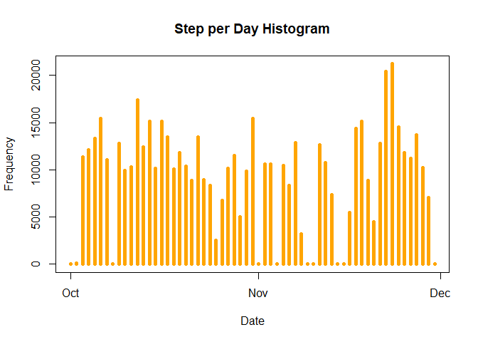
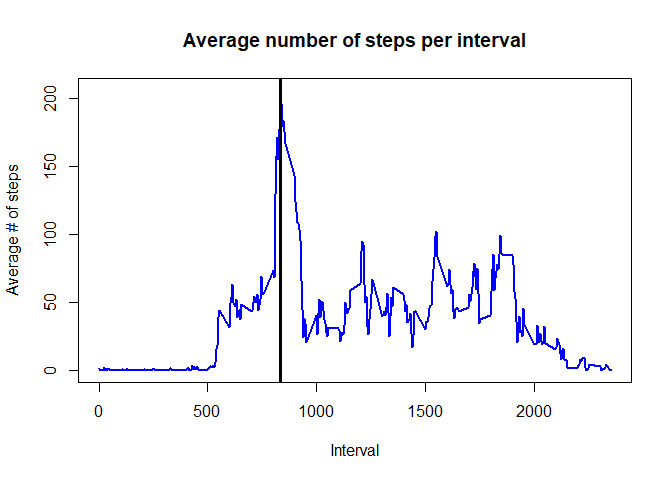
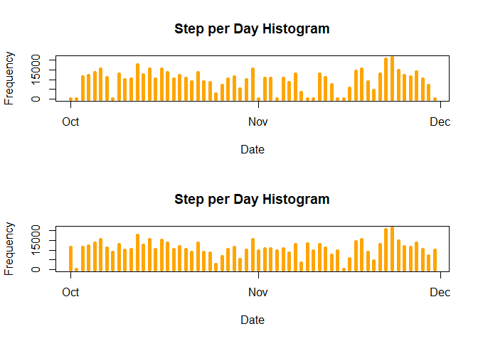
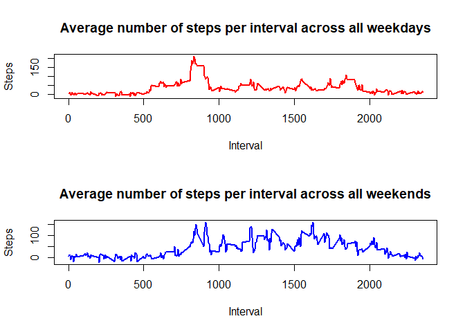

Reproducible Research Course Project 1

It is now possible to collect a large amount of data about personal
movement using activity monitoring devices such as a Fitbit, Nike
Fuelband, or Jawbone Up. These type of devices are part of the
“quantified self” movement – a group of enthusiasts who take
measurements about themselves regularly to improve their health, to find
patterns in their behavior, or because they are tech geeks. But these
data remain under-utilized both because the raw data are hard to obtain
and there is a lack of statistical methods and software for processing
and interpreting the data.

This assignment makes use of data from a personal activity monitoring
device. This device collects data at 5 minute intervals through out the
day. The data consists of two months of data from an anonymous
individual collected during the months of October and November, 2012 and
include the number of steps taken in 5 minute intervals each day.

### Including Plots

1.Load the data

    library(ggplot2)
    library(dplyr)

    currentdir <- "D:/Coursera/Github/RepData_PeerAssessment1/data"
    setwd(currentdir)
    activityraw <- read.csv("activity.csv")

2.Process/transform the data

    dates <- strptime(activityraw$date, "%Y-%m-%d")
    activityraw$date <- dates

### What is mean total number of steps taken per day?

1.Calculate the total number of steps taken per day

    rawsplit <- split(activityraw$steps, dates$yday)
    totalStepsPerDay <- sapply(rawsplit, sum, na.rm=TRUE)
    uniquedates <- unique(activityraw$date)

2.Create a histogram of the total number of steps taken each day

    plot(uniquedates, totalStepsPerDay, main = "Step per Day Histogram", xlab = "Date", ylab = "Frequency", type= "h", lwd = 5, col = "orange")

### 3.Calculate and report the mean and median of the total number of steps taken per day

The mean steps per day

    meanStepsPerDay <- sapply(rawsplit, mean, na.rm = TRUE)
    meanDataFrame <- data.frame(date=uniquedates, meanStepsPerDay=meanStepsPerDay, row.names=NULL)

The median steps per day

    medianStepsPerDay <- sapply(rawsplit, median, na.rm = TRUE)
    medianDataFrame <- data.frame(date=uniquedates, medianstepsperday=medianStepsPerDay, row.names=NULL)

1.Make a time series plot (i.e. type = “l”) of the 5-minute interval
(x-axis) and the average number of steps taken, averaged across all days
(y-axis)

    uniqueintervals <- unique(activityraw$interval)
    rawintervalsplit <- split(activityraw$steps, activityraw$interval)

    meanStepsPerInterval <- sapply(rawintervalsplit, mean, na.rm = TRUE)

    plot(uniqueintervals, meanStepsPerInterval, type="l",
         main="Average number of steps per interval", 
         xlab="Interval", ylab="Average # of steps", 
         lwd=2, col="blue")

    maxIntervalDays <- max(meanStepsPerInterval, na.rm=TRUE)
    maxIndex <- as.numeric(which(meanStepsPerInterval == maxIntervalDays))

    maxInterval <- uniqueintervals[maxIndex]
    abline(v=maxInterval, col="black", lwd=3)

### 2.Which 5-minute interval, on average across all the days in the dataset, contains the maximum number of steps?

1.Calculate and report the total number of missing values in the dataset

    sum(is.na(activityraw$steps))

    ## [1] 2304

2.Devise a strategy for filling in all of the missing values in the
dataset. The strategy does not need to be sophisticated. For example,
you could use the mean/median for that day, or the mean for that
5-minute interval, etc.

    ### Using Amelia package for imputing missing data in a data set

    library(Amelia)
    ameliafit <- amelia(activityraw, m = 1, idvars = "date")

    ## -- Imputation 1 --
    ## 
    ##   1  2

    newactivityraw <- ameliafit$imputations[[1]]
    summary(newactivityraw)

    ##      steps             date                    
    ##  Min.   :-345.7   Min.   :2012-10-01 00:00:00  
    ##  1st Qu.:   0.0   1st Qu.:2012-10-16 00:00:00  
    ##  Median :   0.0   Median :2012-10-31 00:00:00  
    ##  Mean   :  37.1   Mean   :2012-10-31 00:25:34  
    ##  3rd Qu.:  26.0   3rd Qu.:2012-11-15 00:00:00  
    ##  Max.   : 806.0   Max.   :2012-11-30 00:00:00  
    ##     interval     
    ##  Min.   :   0.0  
    ##  1st Qu.: 588.8  
    ##  Median :1177.5  
    ##  Mean   :1177.5  
    ##  3rd Qu.:1766.2  
    ##  Max.   :2355.0

Checking the total number of missing data after imputing

    sum(is.na(newactivityraw$steps))

    ## [1] 0

3.Create a new dataset that is equal to the original dataset but with
the missing data filled in.

    stepsSplitNew <- split(newactivityraw$steps, dates$yday)
    totalStepsPerDayNew <- sapply(stepsSplitNew, sum)

4.Make a histogram of the total number of steps taken each day and
Calculate and report the mean and median total number of steps taken per
day. Do these values differ from the estimates from the first part of
the assignment? What is the impact of imputing missing data on the
estimates of the total daily number of steps?

With this new data, let’s calculate the mean over all days (like in Part
2). As a side-by-side comparison, we will place the data before
imputing, as well as the new one in the same data frame.

    meanStepsPerDayNew <- sapply(stepsSplitNew, mean)
    meanDataFrameNew <- data.frame(date=uniquedates, meanStepsPerDay=meanStepsPerDay, 
    meanStepsPerDayNew=meanStepsPerDayNew, row.names=NULL)
    meanDataFrameNew

    ##          date meanStepsPerDay meanStepsPerDayNew
    ## 1  2012-10-01             NaN         39.4954252
    ## 2  2012-10-02       0.4375000          0.4375000
    ## 3  2012-10-03      39.4166667         39.4166667
    ## 4  2012-10-04      42.0694444         42.0694444
    ## 5  2012-10-05      46.1597222         46.1597222
    ## 6  2012-10-06      53.5416667         53.5416667
    ## 7  2012-10-07      38.2465278         38.2465278
    ## 8  2012-10-08             NaN         30.5067978
    ## 9  2012-10-09      44.4826389         44.4826389
    ## 10 2012-10-10      34.3750000         34.3750000
    ## 11 2012-10-11      35.7777778         35.7777778
    ## 12 2012-10-12      60.3541667         60.3541667
    ## 13 2012-10-13      43.1458333         43.1458333
    ## 14 2012-10-14      52.4236111         52.4236111
    ## 15 2012-10-15      35.2048611         35.2048611
    ## 16 2012-10-16      52.3750000         52.3750000
    ## 17 2012-10-17      46.7083333         46.7083333
    ## 18 2012-10-18      34.9166667         34.9166667
    ## 19 2012-10-19      41.0729167         41.0729167
    ## 20 2012-10-20      36.0937500         36.0937500
    ## 21 2012-10-21      30.6284722         30.6284722
    ## 22 2012-10-22      46.7361111         46.7361111
    ## 23 2012-10-23      30.9652778         30.9652778
    ## 24 2012-10-24      29.0104167         29.0104167
    ## 25 2012-10-25       8.6527778          8.6527778
    ## 26 2012-10-26      23.5347222         23.5347222
    ## 27 2012-10-27      35.1354167         35.1354167
    ## 28 2012-10-28      39.7847222         39.7847222
    ## 29 2012-10-29      17.4236111         17.4236111
    ## 30 2012-10-30      34.0937500         34.0937500
    ## 31 2012-10-31      53.5208333         53.5208333
    ## 32 2012-11-01             NaN         32.4040602
    ## 33 2012-11-02      36.8055556         36.8055556
    ## 34 2012-11-03      36.7048611         36.7048611
    ## 35 2012-11-04             NaN         33.5646422
    ## 36 2012-11-05      36.2465278         36.2465278
    ## 37 2012-11-06      28.9375000         28.9375000
    ## 38 2012-11-07      44.7326389         44.7326389
    ## 39 2012-11-08      11.1770833         11.1770833
    ## 40 2012-11-09             NaN         45.6433174
    ## 41 2012-11-10             NaN         32.4998166
    ## 42 2012-11-11      43.7777778         43.7777778
    ## 43 2012-11-12      37.3784722         37.3784722
    ## 44 2012-11-13      25.4722222         25.4722222
    ## 45 2012-11-14             NaN         33.5554285
    ## 46 2012-11-15       0.1423611          0.1423611
    ## 47 2012-11-16      18.8923611         18.8923611
    ## 48 2012-11-17      49.7881944         49.7881944
    ## 49 2012-11-18      52.4652778         52.4652778
    ## 50 2012-11-19      30.6979167         30.6979167
    ## 51 2012-11-20      15.5277778         15.5277778
    ## 52 2012-11-21      44.3993056         44.3993056
    ## 53 2012-11-22      70.9270833         70.9270833
    ## 54 2012-11-23      73.5902778         73.5902778
    ## 55 2012-11-24      50.2708333         50.2708333
    ## 56 2012-11-25      41.0902778         41.0902778
    ## 57 2012-11-26      38.7569444         38.7569444
    ## 58 2012-11-27      47.3819444         47.3819444
    ## 59 2012-11-28      35.3576389         35.3576389
    ## 60 2012-11-29      24.4687500         24.4687500
    ## 61 2012-11-30             NaN         34.1192946

Like the above, the median steps per day are:

    medianStepsPerDayNew <- sapply(stepsSplitNew, median)
    medianDataFrameNew <- data.frame(date=uniquedates, medianStepsPerDay=medianStepsPerDay, 
    medianStepsPerDayNew=medianStepsPerDayNew, row.names=NULL)

### Are there differences in activity patterns between weekdays and weekends?

1.Create a new factor variable in the dataset with two levels :weekdayây
and weekendây indicating whether a given date is a weekday or weekend
day.

    wdays <- dates$wday

    ### Create a numeric vector with 2 levels - 1 is for a weekday, 2 for a weekend
    classifywday <- rep(0, length(wdays)-1)

    classifywday[wdays >= 1 & wdays <= 5] <- 1
    classifywday[wdays == 6 | wdays == 0] <- 2

    daysFactor <- factor(classifywday, levels=c(1,2), labels=c("Weekdays", "Weekends"))

    newactivityraw$typeOfDay <- daysFactor

    activityWeekdays <- newactivityraw[newactivityraw$typeOfDay == "Weekdays", ]
    activityWeekends <- newactivityraw[newactivityraw$typeOfDay == "Weekends", ]

2.Make a panel plot containing a time series plot (i.e. type = “l”) of
the 5-minute interval (x-axis) and the average number of steps taken,
averaged across all weekday days or weekend days (y-axis). See the
README file in the GitHub repository to see an example of what this plot
should look like using simulated data

    activitySplitWeekdays <- split(activityWeekdays$steps, activityWeekdays$interval)
    activitySplitWeekends <- split(activityWeekends$steps, activityWeekends$interval)

    meanStepsPerWeekdayInterval <- sapply(activitySplitWeekdays, mean)
    meanStepsPerWeekendInterval <- sapply(activitySplitWeekends, mean)

    par(mfcol=c(2,1))
    plot(unique(newactivityraw$interval), meanStepsPerWeekdayInterval, type="l",
    main="Average number of steps per interval across all weekdays", 
    xlab="Interval", ylab="Steps", 
    lwd=2, col="red")
    plot(unique(newactivityraw$interval), meanStepsPerWeekendInterval, type="l",
    main="Average number of steps per interval across all weekends", 
    xlab="Interval", ylab="Steps", 
    lwd=2, col="blue")

